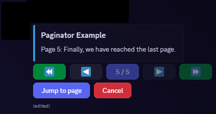

# poise_paginator
A small library to help you visualize some data through your `poise` discord bot!




## Example usage

```rust
async fn page_generator(
    _ctx: Context<'_>,
    idx: usize,
    cancellation_type: CancellationType,
    state: Arc<[&str]>,
) -> Result<CreateEmbed, Error> {
    let embed = CreateEmbed::default()
        .title("Paginator Example")
        // this is safe! Index cannot go out of bounds
        .description(state[idx])
        .color(poise::serenity_prelude::Color::BLUE)
        .apply_if(cancellation_type == CancellationType::Timeout, |embed| {
            embed.footer(CreateEmbedFooter::new("Cancelled due to timeout"))
        })
        .apply_if(cancellation_type == CancellationType::UserInput, |embed| {
            embed.footer(CreateEmbedFooter::new("Cancelled by the user"))
        });

    Ok(embed)
}

#[command(slash_command)]
pub async fn test_paginate(ctx: Context<'_>) -> Result<(), Error> {
    let pages: Arc<[&str]> = [
        "Page 1: Welcome to the paginator example!",
        "Page 2: This is the second page.",
        "Page 3: Here is the third page.",
        "Page 4: And this is the fourth page.",
        "Page 5: Finally, we have reached the last page.",
    ]
    .into();

    paginate(
        ctx,
        page_generator,
        pages.len(),
        Duration::from_secs(60),
        pages,
    )
    .await?;

    Ok(())
}
```
As you can probably see, this happens lazily. You pass an async `generator` function that generates your pages. For more information check the docs.

An example can be found in [examples/basic_usage/](examples/basic_usage/).


# Important note
This only works with slash commands. 